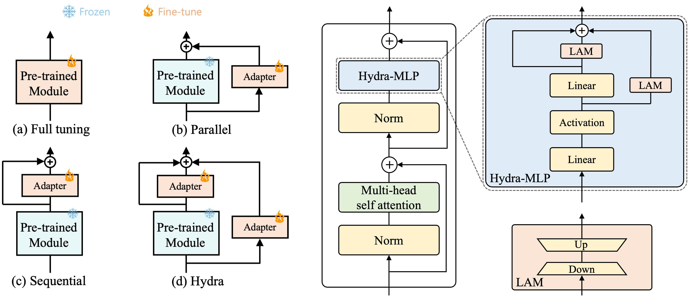

# Hydra: Multi-head Low-rank Adaptation for Parameter Efficient Fine-tuning
Sanghyeon Kim*, Hyunmo Yang*, Younghyun Kim*, Youngjoon Hong†, and Eunbyung Park†  

An official implementation of "Hydra: Multi-head Low-rank Adaptation for Parameter Efficient Fine-tuning".

## Abstract
*The recent surge in large-scale foundation models has spurred the development of efficient methods for adapting these models to various downstream tasks. Low-rank adaptation methods, such as LoRA, have gained significant attention due to their outstanding parameter efficiency and no additional inference latency. This paper investigates a more general form of adapter module based on the analysis that parallel and sequential adaptation branches learn novel and general features during fine-tuning, respectively. The proposed method, named Hydra, due to its multi-head computational branches, combines parallel and sequential branch to integrate capabilities, which is more expressive than existing single branch methods and enables the exploration of a broader range of optimal points in the fine-tuning process. In addition, the proposed adaptation method explicitly leverages the pre-trained weights by performing a linear combination of the pre-trained features. It allows the learned features to have better generalization performance across diverse downstream tasks. Furthermore, we perform a comprehensive analysis of the characteristics of each adaptation branch with empirical evidence. Through an extensive range of experiments, encompassing comparisons and ablation studies, we substantiate the efficiency and demonstrate the superior performance of Hydra. This comprehensive evaluation underscores the potential impact and effectiveness of Hydra in a variety of applications.*

    

## Setup & running code

**You can run experiments in each directory.** 

Each directory includes results, setup, and scripts.

 * [elevater](https://github.com/extremebird/Hydra/tree/main/elevater) : Few-shot experiments  
 * [vtab1k](https://github.com/extremebird/Hydra/tree/main/vtab1k) : VTAB-1k experiments  
 * [nlu](https://github.com/extremebird/Hydra/tree/main/nlu): Natural language understanding experiments

## Acknowledgement

- The ```elevater``` implementation is based on the code of [KAdaptation](https://github.com/eric-ai-lab/PEViT)
- The ```vtab1k``` implementation is based on the code of [Repadapter](https://github.com/luogen1996/RepAdapter)
- The ```nlu``` implementation is based on the code of [LoRA](https://github.com/microsoft/LoRA), using [transformer](https://github.com/huggingface/transformers).

We sincerely appreciate for releasing their studies and code implementation.

## License
This project is released under the MIT license.

## Citation
